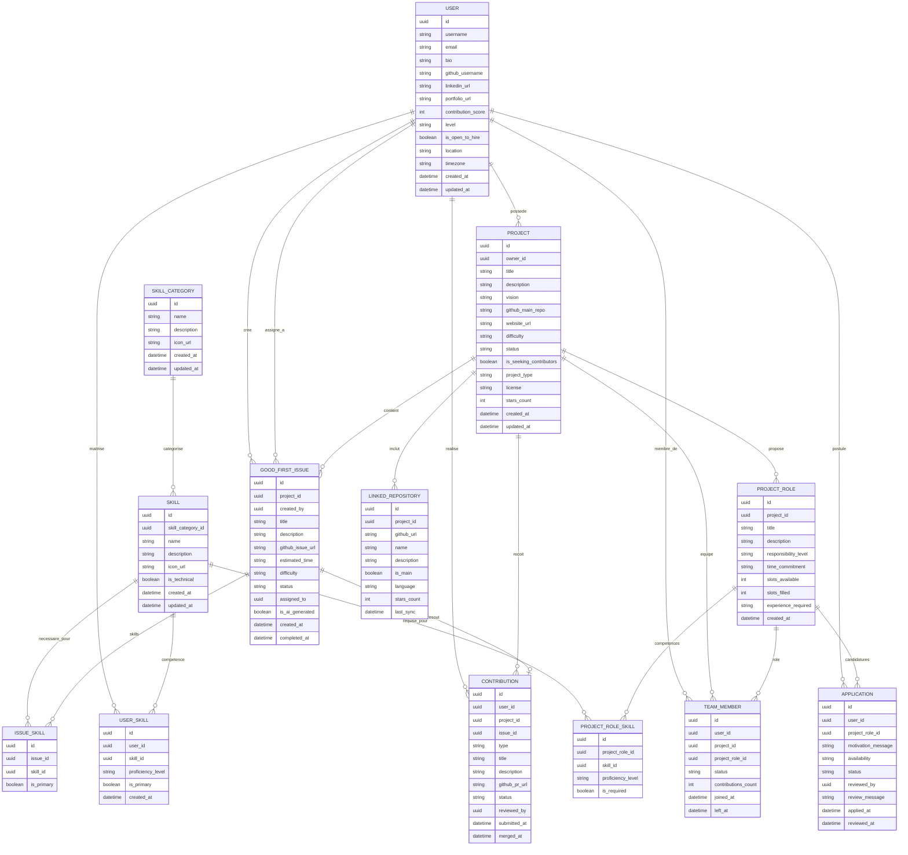

# 🏗️ Modèle Conceptuel de Données (MCD) — Open Source Together

## 📋 Vue d'ensemble

Ce document présente le **Modèle Conceptuel de Données** d'OST, définissant les entités métier et leurs relations selon la méthode MERISE.

## 🎯 Segmentation MVP vs Future

Ce MCD est organisé en deux niveaux de priorité :
- **🔴 MVP (Minimum Viable Product)** : Entités et relations essentielles pour le lancement
- **🔵 Future** : Fonctionnalités avancées à implémenter plus tard
- **🟡 À Discuter** : Points nécessitant une validation équipe avant implémentation

---

## 🎯 Entités Principales

### **Entités Centrales (MVP)**
- **User** : Utilisateurs de la plateforme
- **Project** : Projets open source
- **SkillCategory** : Catégories de compétences (Frontend, Backend, Design, Marketing, etc.)
- **Skill** : Compétences techniques et non-techniques (inclut les TechStacks)
- **ProjectRole** : Rôles disponibles dans les projets

### **Entités de Liaison (MVP)**
- **Application** : Candidatures aux rôles
- **TeamMember** : Membres actifs des projets
- **UserSkill** : Compétences des utilisateurs
- **ProjectRoleSkill** : Compétences requises pour les rôles

### **Entités de Contribution (MVP)**
- **GoodFirstIssue** : Issues pour débutants
- **Contribution** : Contributions réalisées (showcase utilisateur)
- **IssueSkill** : Compétences requises pour les issues

### **Entités de Support (MVP)**
- **LinkedRepository** : Repositories liés aux projets

---

## 🔗 Relations et Cardinalités

### **Relations User-centrées**

#### **User ↔ Project**
- **Relation** : POSSÈDE
- **Cardinalité** : `1:N` (Un utilisateur peut posséder plusieurs projets)
- **Contrainte** : Un projet a exactement un propriétaire

**Interrogations produit :**
- Limiter le nombre de projets qu'un utilisateur peut créer ?
- Système de validation/modération pour les nouveaux projets ?
- Gestion des projets abandonnés par leur propriétaire ?

**Intérêts business :**
- 📊 **Métriques** : Nombre de projets créés par utilisateur, taux d'abandon
- 🎯 **Quality control** : Identifier les créateurs de projets de qualité
- 💼 **User personas** : Distinguer les "créateurs" des "contributeurs"

#### **User ↔ Skill**
- **Relation** : MAÎTRISE
- **Cardinalité** : `N:M` (via UserSkill)
- **Contrainte** : Un utilisateur peut avoir plusieurs compétences, une compétence peut être maîtrisée par plusieurs utilisateurs

**Interrogations produit :**
- **Validation des compétences** : Pour le MVP, auto-déclaration libre par les utilisateurs. Évolutions futures possibles : système d'endorsement communautaire (type LinkedIn) ou validation par quiz/tests
- **Limitation du nombre de compétences** : Pour le MVP, liberté totale. Évolution future possible : limiter à 10-15 compétences principales pour améliorer la qualité du matching et éviter les profils "touche-à-tout" peu crédibles
- **Niveaux de compétence** : Faut-il distinguer les compétences principales (expert) des compétences secondaires (apprentissage) pour optimiser l'algorithme de recommandation ?

**Intérêts business :**
- 🎯 **Matching** : Base de l'algorithme de recommandation projet ↔ utilisateur
- 📈 **Analytics** : Identifier les compétences les plus demandées
- 💰 **Recrutement** : Data précieuse pour le futur dashboard recruteur

#### **User ↔ ProjectRole**
- **Relation** : POSTULE_À
- **Cardinalité** : `N:M` (via Application)
- **Contrainte** : Un utilisateur peut postuler à plusieurs rôles, un rôle peut recevoir plusieurs candidatures

**🟡 Point à discuter avec l'équipe :**
- **`motivation_message`** dans Application :
  - **Pour** : Améliore la qualité des candidatures, aide le choix des owners
  - **Contre** : Ajoute de la friction, peut décourager les candidatures spontanées
  - **Options** : Obligatoire / Optionnel / Configurable par projet owner
  - **Décision requise** : Validation équipe sur l'approche

**Interrogations produit :**
- Autoriser les candidatures à plusieurs rôles sur le même projet ?
- Limiter le nombre de candidatures actives simultanées ?
- Comment gérer les profils "en apprentissage" vs "experts" ?
- Donner aux owners la possibilité de configurer ces permissions ?

**Intérêts business :**
- 📈 **Métriques** : Taux de conversion candidature → acceptation
- 🎯 **Matching** : Améliorer l'algorithme de recommandation
- 💰 **Business** : Comprendre les patterns de succès
- 🔍 **User behavior** : Analyser les stratégies de candidature

#### **User ↔ Project (Membership)**
- **Relation** : MEMBRE_DE
- **Cardinalité** : `N:M` (via TeamMember)
- **Contrainte** : Un utilisateur peut être membre de plusieurs projets, un projet peut avoir plusieurs membres

**Interrogations produit :**
- Limiter le nombre de projets auxquels un utilisateur peut participer simultanément ?
- Système de notation/feedback entre membres d'équipe ?

**Intérêts business :**
- 📊 **Collaboration metrics** : Mesurer l'engagement et la rétention
- 🎯 **Team dynamics** : Identifier les bons collaborateurs
- 💼 **Success patterns** : Comprendre ce qui fait le succès d'une équipe

### **Relations Project-centrées**

#### **Project ↔ ProjectRole**
- **Relation** : PROPOSE
- **Cardinalité** : `1:N` (Un projet peut proposer plusieurs rôles)
- **Contrainte** : Un rôle appartient à exactement un projet

**Interrogations produit :**
- Limiter le nombre de rôles par projet ?
- Templates de rôles prédéfinis ou création libre ?
- Validation des compétences requises pour chaque rôle ?

**Intérêts business :**
- 📈 **Project analysis** : Analyser la complexité des projets
- 🎯 **Matching optimization** : Améliorer la pertinence des recommandations
- 💡 **Product insights** : Comprendre les besoins récurrents

#### **Project ↔ GoodFirstIssue**
- **Relation** : CONTIENT
- **Cardinalité** : `1:N` (Un projet peut avoir plusieurs issues)
- **Contrainte** : Une issue appartient à exactement un projet

**Interrogations produit :**
- Encourager/obliger les projets à créer des Good First Issues ?
- Système de validation de la qualité des issues ?
- Récompenses pour les mainteneurs qui créent de bonnes issues ?

**Intérêts business :**
- 🚀 **Onboarding** : Faciliter l'entrée de nouveaux contributeurs
- 📊 **Engagement** : Mesurer l'activité et la santé des projets
- 🎯 **Growth** : Augmenter le nombre de contributions actives

#### **Project ↔ LinkedRepository**
- **Relation** : INCLUT
- **Cardinalité** : `1:N` (Un projet peut inclure plusieurs repositories)
- **Contrainte** : Un repository est lié à exactement un projet

**Intérêts business :**
- 🔍 **Découverte** : Meilleure visibilité des projets complexes
- 📊 **Analytics** : Activité des repos, langages utilisés, stars

#### **Project ↔ Contribution**
- **Relation** : REÇOIT
- **Cardinalité** : `1:N` (Un projet peut recevoir plusieurs contributions)
- **Contrainte** : Une contribution concerne exactement un projet

**Interrogations produit :**
- **Source des données** : Pour le MVP, analyse interne des contributions (pas de déclaration utilisateur). Évolution future possible : intégration API GitHub pour tracking automatique des PRs/commits
- **Validation des contributions** : Pas de validation manuelle par les utilisateurs. Les contributions seront analysées et attribuées via des processus internes à OST
- **Visibilité des données** : Stratégie freemium - Dashboard personnel pour les users (leurs propres stats), données détaillées réservées au futur dashboard recruteur payant
- **Scope des contributions** : Focus initial sur les contributions code (PRs, commits). Extension future possible vers design, documentation, marketing

**Intérêts business :**
- 📈 **Project health** : Mesurer la vitalité et l'attractivité des projets via l'activité réelle
- 💰 **Monetization strategy** : Asset data premium pour recruteurs - éviter le "free riding" en gardant les vraies métriques payantes
- 🎯 **User value** : Dashboard personnel pour que les contributeurs voient leur progression
- 📊 **Talent identification** : Identifier les contributeurs de qualité pour le futur produit recrutement
- 🔒 **Competitive advantage** : Les recruteurs ne peuvent pas accéder gratuitement aux profils détaillés via la plateforme publique

### **Relations Skill-centrées**

#### **SkillCategory ↔ Skill**
- **Relation** : CATÉGORISE
- **Cardinalité** : `1:N` (Une catégorie peut contenir plusieurs compétences)
- **Contrainte** : Une compétence appartient à exactement une catégorie

**Interrogations produit :**
- **Gestion du catalogue de compétences** : Pour le MVP, liste fermée et complète gérée par OST (React, Vue, Python, Figma, SEO, etc.). Évolution future : permettre aux users de proposer de nouvelles compétences émergentes (ex: nouveau framework comme "Astro")
- **Ajout de nouvelles compétences** : Si proposition utilisateur activée, qui valide ? Options : validation manuelle par équipe OST, système de votes communautaires, ou réservé aux utilisateurs "trusted"
- **Cohérence du catalogue** : Comment éviter les doublons (React vs React.js) et les compétences non-pertinentes  ? Besoin de guidelines claires et processus de validation
- **Évolution temporelle** : Les catégories doivent-elles évoluer avec les tendances tech ? (ex: nouvelle catégorie "AI/ML" si beaucoup de compétences IA émergent)

**🔵 Évolutions futures :**
- Permettre aux users de proposer de nouvelles compétences émergentes
- Système de validation (équipe OST, votes communautaires, ou utilisateurs "trusted")
**Intérêts business :**
- 🗂️ **Organization** : Interface utilisateur claire avec catégories logiques
- 📊 **Trends** : Identifier les compétences émergentes par catégorie
- 🎯 **Filtering** : Optimiser les recherches et recommandations 
- 🔍 **Market insights** : Analyser la demande par catégorie pour orienter les stratégies produit

#### **Skill ↔ ProjectRole**
- **Relation** : REQUISE_POUR
- **Cardinalité** : `N:M` (via ProjectRoleSkill)
- **Contrainte** : Un rôle peut requérir plusieurs compétences, une compétence peut être requise pour plusieurs rôles

**Interrogations produit :**
- Définir des niveaux de compétence obligatoires vs optionnels ?
- Système de suggestion automatique de compétences pour les rôles ?
- Validation de la cohérence compétences ↔ rôle ?

**Intérêts business :**
- 🎯 **Core matching** : Algorithme central de recommendation
- 📈 **Market insights** : Comprendre la demande par compétence
- 💼 **Skill gaps** : Identifier les compétences rares/demandées

#### **Skill ↔ GoodFirstIssue**
- **Relation** : NÉCESSAIRE_POUR
- **Cardinalité** : `N:M` (via IssueSkill)
- **Contrainte** : Une issue peut nécessiter plusieurs compétences, une compétence peut être nécessaire pour plusieurs issues

**Interrogations produit :**
- Suggestion automatique de compétences pour les issues ?
- Limiter le nombre de compétences par issue ?
- Prioriser une compétence principale par issue ?

**Intérêts business :**
- 🎯 **Onboarding optimization** : Diriger les débutants vers les bonnes issues
- 📊 **Learning paths** : Identifier les progressions de compétences
- 🚀 **Engagement** : Augmenter le taux de résolution des issues

### **Relations de Contribution**

#### **User ↔ GoodFirstIssue**
- **Relation** : ASSIGNÉ_À
- **Cardinalité** : `1:1` (optionnelle)
- **Contrainte** : Une issue peut être assignée à au maximum un utilisateur

**Interrogations produit :**
- Durée maximale d'assignation avant libération automatique ?
- Système de réservation temporaire ?
- Permettre le transfert d'assignation ?

**Intérêts business :**
- ⏱️ **Efficiency** : Éviter les issues bloquées indéfiniment
- 📈 **Completion rate** : Optimiser le taux de résolution
- 🎯 **User satisfaction** : Éviter les frustrations de double travail

#### **User ↔ Contribution**
- **Relation** : RÉALISE
- **Cardinalité** : `1:N` (Un utilisateur peut réaliser plusieurs contributions)
- **Contrainte** : Une contribution est réalisée par exactement un utilisateur

**Interrogations produit :**
- Garder les contributions pour scoring interne ou les exposer publiquement ?
- Validation des contributions par les mainteneurs ?
- Utiliser ces données pour le futur dashboard recruteur ?

**Intérêts business :**
- 👤 **User value** : Dashboard personnel, showcase compétences
- 📊 **OST asset** : Données de valeur pour scoring, analytics
- 💰 **Monetization** : Asset data pour futur produit recruteur premium
- 🎯 **Talent identification** : Identifier les contributeurs de qualité

#### **GoodFirstIssue ↔ Contribution**
- **Relation** : RÉSOUT
- **Cardinalité** : `1:1` (optionnelle)
- **Contrainte** : Une contribution peut résoudre au maximum une issue

**Interrogations produit :**
- Validation automatique de la résolution ou manuelle ?
- Gestion des contributions partielles ?
- Système de feedback sur la qualité de la résolution ?

**Intérêts business :**
- 📈 **Success tracking** : Mesurer l'efficacité du système d'issues
- 🎯 **Quality metrics** : Évaluer la pertinence des Good First Issues
- 🚀 **Gamification** : Potentiel futur système de récompenses

---

## 📊 Diagramme MCD (Mermaid)

### 📋 Légende du Diagramme

**Types d'Entités :**
- **Entités Principales** : USER, PROJECT, SKILL_CATEGORY, SKILL, PROJECT_ROLE
- **Tables de Liaison** : USER_SKILL, PROJECT_ROLE_SKILL, APPLICATION, TEAM_MEMBER
- **Entités de Contribution** : GOOD_FIRST_ISSUE, ISSUE_SKILL, CONTRIBUTION
- **Entités de Support** : LINKED_REPOSITORY

### 🔗 Relations Principales

| Relation | Cardinalité | Description |
|----------|-------------|-------------|
| USER → PROJECT | 1:N | Un utilisateur peut posséder plusieurs projets |
| USER ↔ SKILL | N:M | Via USER_SKILL - compétences des utilisateurs |
| USER ↔ PROJECT_ROLE | N:M | Via APPLICATION - candidatures aux rôles |
| USER ↔ PROJECT | N:M | Via TEAM_MEMBER - participation aux projets |
| SKILL_CATEGORY → SKILL | 1:N | Catégorisation des compétences |
| PROJECT → PROJECT_ROLE | 1:N | Rôles proposés par projet |
| SKILL ↔ PROJECT_ROLE | N:M | Via PROJECT_ROLE_SKILL - compétences requises |
| PROJECT → GOOD_FIRST_ISSUE | 1:N | Issues pour débutants par projet |
| GOOD_FIRST_ISSUE ↔ CONTRIBUTION | 1:1 | Résolution d'issues |

---

## 🔍 Contraintes d'Intégrité

### **Contraintes Métier**

1. **Propriété de projet** : Un utilisateur ne peut pas postuler à un rôle dans son propre projet
2. **Unicité des membres** : Un utilisateur ne peut occuper qu'un seul rôle par projet
3. **Slots disponibles** : Le nombre de membres actifs ne peut pas dépasser les slots disponibles
4. **Assignment d'issues** : Une issue ne peut être assignée qu'à un membre du projet
5. **Cohérence des contributions** : Une contribution ne peut être liée qu'à une issue du même projet
6. **Compétences obligatoires** : Un ProjectRole doit avoir au minimum une compétence associée

### **Contraintes Techniques**

1. **Unicité conditionnelle** : github_username unique si non null
2. **Validation des URLs** : Tous les champs URL doivent respecter le format URI
3. **Cohérence temporelle** : reviewed_at >= applied_at pour les candidatures
4. **Scores positifs** : contribution_score >= 0
5. **Catégories requises** : Chaque Skill doit appartenir à une SkillCategory

### **Contraintes de Statut**

1. **Progression des candidatures** : pending → accepted/rejected (pas de retour en arrière)
2. **Statut des issues** : open → assigned → in_progress → completed/closed
3. **Statut des contributions** : submitted → reviewed → merged/rejected

---

## 🎯 Points d'Attention pour l'Implémentation

### **Performance**
- Index sur les FK fréquemment utilisées (user_id, project_id, skill_category_id)
- Index composé sur (project_id, status) pour les candidatures
- Index sur contribution_score pour les classements
- Index sur (skill_category_id, name) pour les recherches de compétences

### **Évolutivité**
- Structure extensible pour ajouter de nouvelles catégories de compétences
- Système de scoring modulaire via contribution_score
- Support multi-repository via LinkedRepository
- Matching algorithmique basé sur les compétences (pas de pré-calcul)

### **Intégrité**
- Cascades appropriées pour les suppressions
- Validation des contraintes métier au niveau application
- Audit trail via created_at/updated_at

### **Recommandations Futures**
- **Algorithme de matching** : Calculé à la volée basé sur UserSkill ↔ ProjectRoleSkill
- **Personas** : Groupement d'utilisateurs par profils similaires pour optimiser les recommandations
- **Contribution tracking** : Intégration GitHub optionnelle pour automatiser le scoring

---

## 📝 Changements Majeurs Appliqués

### **✅ Ajouts**
- **SkillCategory** : Organisation claire des compétences
- **Contrainte compétences obligatoires** : ProjectRole doit avoir des skills

### **🔄 Modifications**
- **Skill élargi** : Inclut maintenant les TechStacks (React, Node.js, etc.) et compétences non-techniques
- **ProjectRole** : Titre libre + matching via compétences
- **Contribution simplifiée** : Focus showcase utilisateur, pas d'intégration GitHub complexe

### **❌ Suppressions**
- **ProjectRecommendation** : Remplacé par algorithme à la volée
- **TechStack** : Fusionné dans Skill

---

*Ce MCD révisé offre un équilibre entre simplicité d'implémentation et évolutivité future, en éliminant les complexités prématurées tout en gardant la flexibilité nécessaire.*

*Ce MCD servira de base pour la création du Modèle Logique de Données (MLD) et l'implémentation du schema Prisma.* 